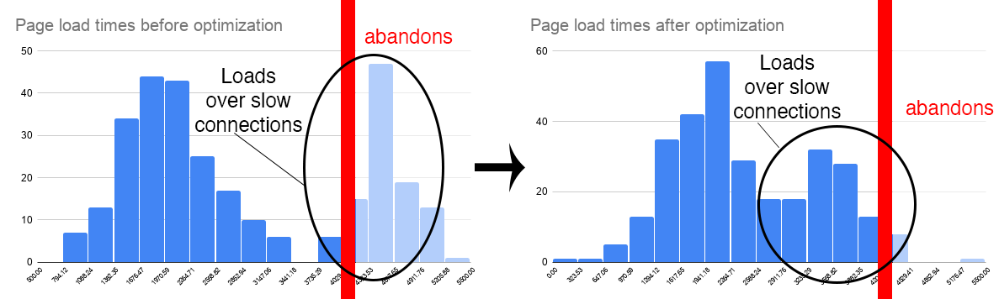

# Proposal: Metrics for web page abandonment
Author: sullivan@chromium.org, skobes@chromium.org

Last modified: 2020-02-13

## Why are abandonment metrics important?
### A blind spot for real user monitoring
Currently, when users navigate away from a page before loading metrics like first contentful paint fire, the page’s analytics may not be loaded yet, and so the abandoned page load is not counted in the site’s analytics. This means client-side analytics, which many sites rely on, are blind to abandoned navigations that do not get to a point where the analytics script is able to execute and beacon a successful page hit.

Server-side analytics can be used to close part of this gap, but not completely, because there are also page loads that may not successfully reach the server — e.g. due to network timeouts, network routing issues, etc.

Today, developers do not have a simple or reliable way to establish a baseline of abandoned navigations. This means that today’s baselines are ignoring what might be a large portion of navigations, giving an incomplete and skewed picture.

### Understanding how performance impacts user experience
Google search saw a 20% reduction in abandonment rate after taking site performance into account in ranking. It’s currently difficult for sites to get data about their own abandonment rates as abandonment tends to occur before analytics scripts are loaded. Having more data on early abandonment would make it easier to understand the impact of performance improvements.

### Impact of early abandonment on performance metrics
Imagine that a page took over 4 seconds to reach first contentful paint on very slow connections, and 2 seconds on fast connections. But most users abandoned the page load after waiting 4 seconds with no contentful paint. Let’s say the developers made an improvement on slow connections, and now it takes closer to 3 seconds to load on slow connections, with no difference on fast connections. The page loads before and after the change might look like this:



RUM analytics tools generally aren’t able to record page loads that end early in loading, so only after the improvement they start reporting the page loads on slow connections when they weren’t able to before. Now the RUM metrics include the slow page loads, and first contentful paint graphs look slower than before the improvement!

Developers will be able to make some conclusions based on the increased number of page loads, but if they were able to analyze data on abandonment rates in addition to performance metrics, they’d have a much better ability to understand the impact of their performance improvements, especially in the long tail of very slow page loads.

## Goals:
* Provide information to sites about early abandonment.
* Make abandonment information available to sites that are using best performance practices, like deferring the load and execution of JavaScript that’s not required for the core user experience.
* Make abandonment information available to sites that are using third party analytics providers which load scripts after the page may already have been abandoned.

## Non-Goals:
* Provide information about the reasons users may have abandoned the site. It’s not possible to understand if a user navigated away from a site due to slow performance, clicking the wrong link, or some other reason.
* Provide a significant amount of information that’s not currently possible for a site to compute about abandonment. Sites could use the Network Error Logging API’s `abandoned` error and/or server logs in combination with injecting JavaScript very early in the load to track early abandonments themselves, with few gaps. But this would be prohibitively complex. It would make performance worse, and often sites use third party analytics providers which would load after the abandonment.

## Defining Abandonment
We define abandonment as a **user-initiated** navigation away from the page **before it reaches first contentful paint**.

The navigation away from the page should be user-initiated (not a redirect) because we’re measuring user abandonment of pages. We propose not to include navigations that fail with errors due to timeouts, http errors, or other failures as those are handled in the [Network Error Logging API](https://www.w3.org/TR/network-error-logging/), and they’re not user-initiated.

We think pages should be considered abandoned before they reach first contentful paint because the user navigated away before any useful information was shown. It’s the latest point at which we know the user did not just find what they were looking for and navigate away.

## Alternatives considered to first contentful paint:
* User abandoned the initial network request for the page. This use case is already covered by the [Network Error Logging API](https://www.w3.org/TR/network-error-logging/). But we believe it does not measure enough of the page load; the average web page makes about [70 requests](https://httparchive.org/reports/state-of-the-web#reqTotal) during load, and this API only tracks if the first one is abandoned before it is committed.
* The [Largest Contentful Paint](https://web.dev/lcp/) metric tracks when the main content of the page is displayed to the user. If it were possible to use this metric for abandonment, it would be great to consider. But it reports the largest contentful paint seen so far in the page load; we don’t know if a larger one might have been seen after abandonment. So in practice, reporting “abandonment before largest contentful paint” would be the same as abandonment before first contentful paint.
* [DOM Content Loaded](https://developer.mozilla.org/en-US/docs/Web/API/Window/DOMContentLoaded_event) and [onload](https://developer.mozilla.org/en-US/docs/Web/API/Window/load_event) aren’t defined in terms of user experience. There’s no way to know what the page looked like to the user before/after these events fired. Perhaps they got the content they needed and navigated to a new page.
* [First input](https://web.dev/fid/) doesn’t occur on every page, and the user may have found the page useful before navigating away without an input.

Another alternative would be to view the page as not abandoned **after the analytics script has loaded**. This isn’t a user-centric definition, but it would ensure the gap between starting a page load and counting it in analytics is addressed. This would involve something like a reporting API or a snippet of JavaScript in the beginning of the document to start abandonment reporting, and a snippet of JavaScript in the fully loaded analytics script to “turn off” abandonment reporting.

## Exposing abandonment to web developers
There are multiple options for exposing this information to web developers. We’d like feedback on them!

### Option A: Chrome User Experience Report
Exposing abandonment rates via [Chrome User Experience Report](https://developers.google.com/web/tools/chrome-user-experience-report) would give a baseline of abandonment rates to developers.

### Option B: Reporting API
We could consider a [Reporting API](https://developers.google.com/web/updates/2018/09/reportingapi) for abandonment. Example:

```
Report-To: {
             "group": "abandon-endpoint",
             "max_age": 10886400,
             "endpoints": [{
               "url": "https://example.com/abandon-reports"
             }]
           }
```

One concern here is the overlap with the `abandoned` error in the [Network Error Logging API](https://www.w3.org/TR/network-error-logging/). That API is similar, but subtly different:
* It reports abandonment for **all** network requests, not just page loads.
* It only reports abandonment for the **request**, not the **page load**. For example, if the initial HTML of the page loads fully, but the user abandons the page before content displays, it's not abandonment from the NEL perspective but it is from this API's perspective.
